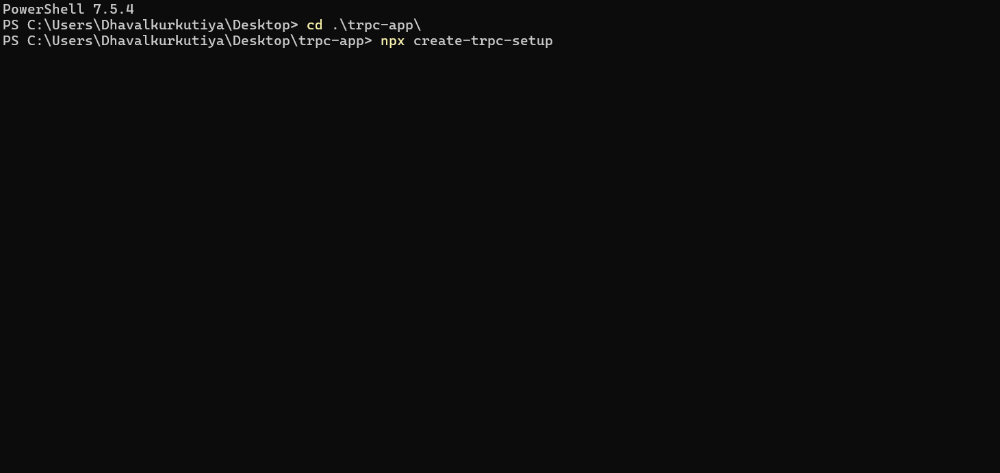

# create-trpc-setup

[](https://www.npmjs.com/package/create-trpc-setup)
[](https://www.npmjs.com/package/create-trpc-setup)
[](https://trpc.io)
[](https://nextjs.org)
[](LICENSE)

> One-command tRPC v11 setup for **existing** Next.js App Router projects.

```bash
npx create-trpc-setup
```



---

## Why this exists

`create-t3-app` is great — but only for **new** projects.

`create-trpc-setup` works with projects you've **already started**.

|                               | `create-t3-app` | `create-trpc-setup` |
| ----------------------------- | --------------- | ------------------- |
| New projects                  | ✅              | ✅                  |
| **Existing projects**         | ❌              | ✅                  |
| Auto-patches layout.tsx       | ❌              | ✅                  |
| Clerk / NextAuth detection    | ❌              | ✅                  |
| tsconfig path alias detection | ❌              | ✅                  |
| tRPC v11 + RSC                | ✅              | ✅                  |

---

## What it does

```bash
npx create-trpc-setup
```

1. ✅ Detects `src/` or root layout
2. ✅ Reads `tsconfig.json` for your path alias (`@/*`, `~/*`, etc.)
3. ✅ Detects Clerk or NextAuth — configures context automatically
4. ✅ Installs all dependencies with your package manager
5. ✅ Generates all 6 tRPC files
6. ✅ **Auto-patches `layout.tsx`** — adds `TRPCReactProvider` inside `<body>`
7. ✅ Creates `/trpc-status` page to verify setup

---

## Files generated

```
trpc/
├── init.ts              ← context, baseProcedure, protectedProcedure, Zod error formatter
├── query-client.ts      ← SSR-safe QueryClient
├── client.tsx           ← TRPCReactProvider + useTRPC hook
├── server.tsx           ← prefetch, HydrateClient
└── routers/
    └── _app.ts          ← starter router with health + greet (Zod)

app/api/trpc/[trpc]/
└── route.ts             ← API handler with real headers + dev error logging

app/trpc-status/         ← test page (delete after confirming ✅)
```

---

## Usage after setup

**Server Component:**

```tsx
import { HydrateClient, prefetch, trpc } from "@/trpc/server";
import { MyClient } from "./my-client";

export default function Page() {
  prefetch(trpc.greet.queryOptions({ name: "World" }));
  return (
    <HydrateClient>
      <MyClient />
    </HydrateClient>
  );
}
```

**Client Component:**

```tsx
"use client";
import { useSuspenseQuery } from "@tanstack/react-query";
import { useTRPC } from "@/trpc/client";

export function MyClient() {
  const trpc = useTRPC();
  const { data } = useSuspenseQuery(trpc.greet.queryOptions({ name: "World" }));
  return <div>{data.message}</div>;
}
```

**Protected route:**

```ts
// trpc/routers/_app.ts
getProfile: protectedProcedure.query(({ ctx }) => {
  return { userId: ctx.userId }; // guaranteed non-null
}),
```

---

## Supported

- **Package managers**: `npm` · `pnpm` · `yarn` · `bun`
- **Next.js**: 14 · 15+
- **Auth**: Clerk · NextAuth / Auth.js · None
- **Path aliases**: `@/*` · `~/*` · any custom alias from `tsconfig.json`

---

## Author

**Dhaval Kurkutiya** — [GitHub](https://github.com/Dhavalkurkutiya) · [npm](https://www.npmjs.com/~dhavalkurkutiya)

If this saved you time, please ⭐ the repo — it helps others find it!

---

## License

MIT
